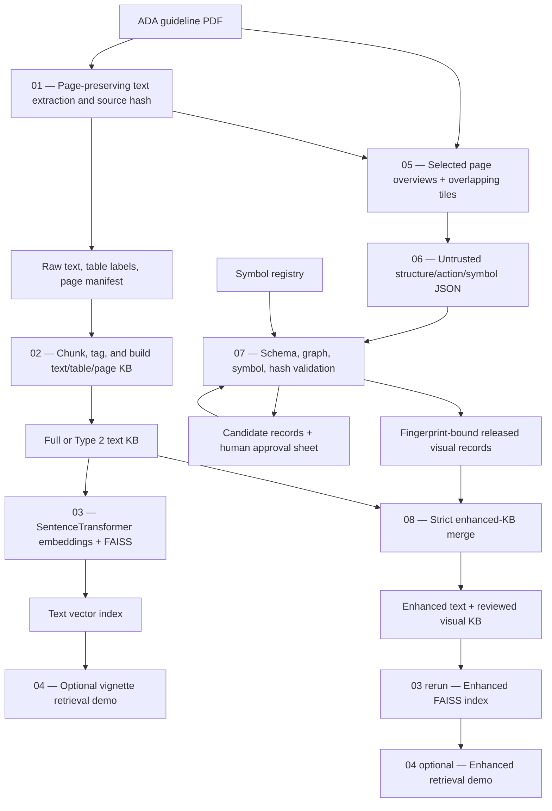

# ADA Guideline RAG Pipeline — Current Implementation and Project Status

> Audit date: 2026-08-22
>
> Repository baseline audited: `main` at `d4d09f1c5d8eab91d66bfd44eaebd965dd8f2a3a`; execution evidence was collected against the candidate patch later prepared for commit
>
> Evidence rule: results below are explicitly separated into tracked repository evidence, current code that was executed, and synthetic software-fixture evidence. Synthetic records are not ADA guideline findings.
>
> **Current live-validation update:** Ollama 0.32.9 and `qwen3-vl:8b-instruct` were subsequently exercised against real rendered tiles. One Figure 9.4 tile completed all three extraction passes and produced 34 structurally valid, unreleased candidates. A full run was interrupted after 33 of 60 tiles and did not produce a canonical final manifest. No visual candidate received human approval, so the enhanced KB remains 234 base records plus 0 released visual records. See `ADA_VISUAL_RAG_VALIDATION_REPORT.md` for the detailed live-run evidence. Historical placeholder results below are retained only where explicitly labeled as the earlier baseline.

## 1. Executive Summary

The ADA guideline knowledge-base work is retrieval infrastructure for the Hyperglycemia AI Capstone. Its intended role is to make relevant guideline evidence easier to retrieve and audit when the project later compares AI-generated diabetes or hyperglycemia management plans with ADA recommendations. It is not a clinical decision system, does not itself generate a treatment plan, and has not demonstrated improved clinical outcomes or clinical accuracy.

The repository shows a clear development sequence. A small, curated ADA 2026 pharmacotherapy knowledge base and executable R scoring demo were committed on 2026-07-07. A separate Python/LlamaIndex retriever followed on 2026-07-17. The numbered open-source text pipeline, Steps 01–04, was committed on 2026-07-18. The visual extension—Steps 05–08, the symbol registry, enhanced-index support, and related documentation—was committed on 2026-08-02. The extensive safety and reliability changes were an uncommitted candidate patch when execution evidence was collected, so the earlier Git history does not support attributing those changes to a particular person.

The technical problem is real: conventional PDF text extraction can recover nearby words while losing the relationships that make a treatment algorithm meaningful. Boxes, arrow direction, branch labels, spatial groupings, footnotes, and repeated `+` or `$` symbols may not survive as usable text. The July text pipeline could create chunks, table/page records, embeddings, and a retrieval demo, but it did not transcribe a visual flowchart into explicit nodes, edges, actions, and symbol semantics.

The current implementation adds a deliberately gated visual branch. It renders selected pages as a whole-page overview and overlapping high-resolution tiles; sends tiles to a local vision model in separate structure, medication-action, and symbol passes; validates the returned graph, schema, symbols, source paths, and hashes; requires human approval tied to an exact content fingerprint; and merges only released visual records into the enhanced knowledge base. The current default local model is `qwen3-vl:8b-instruct`, selected after the thinking tag returned JSON only in Ollama's reasoning field. An Ollama preflight is designed to stop before extraction when the server, model, architecture, structured-output support, or vision runner is incompatible.

The software and non-vision portions performed well in this audit. All eight scripts compiled and exposed a working CLI in an isolated Python 3.12.4 environment, and all 94 focused tests passed. The 29 tracked knowledge-base records—9 text summaries, 8 medication-class rows, and 12 decision rules—were embedded with `sentence-transformers/all-MiniLM-L6-v2` and indexed with FAISS. Six distinct cases selected from the tracked 300-row/100-case capstone file each returned eight records, producing 48 retrieval rows with no missing scores or duplicate case/chunk pairs. This proves the current code can index and retrieve the existing compact KB; it does not establish retrieval relevance or clinical correctness.

A real local source is now available: the untracked 1,517,392-byte file `ADA principles for pharmacologic therapy.pdf`, whose metadata identifies the 33-page ADA Standards of Care in Diabetes—2026 pharmacotherapy section. Step 01 processed all 33 PDF pages with the `pypdf` fallback and recorded source SHA-256 `7c2913f79b61bc60f8f51327bb73b80391988fd277116b29e57df4242b2a2404`. Step 02 produced a 234-record full KB (193 text chunks, 8 table records, and 33 page/figure records) and a 177-record Type 2-focused KB (148, 8, and 21 records, respectively). Both were indexed, and six real capstone cases produced 48 retrieval rows per corpus. These are genuine source-processing and retrieval runs, but retrieval relevance was not graded.

The real renderer selected ten source pages: Figures 9.1–9.5 on PDF pages 2, 6, 8, 9, and 16; the four-page Table 9.2 on pages 11–14; and Table 9.3 on page 21. Table 9.2 pages 11–13 are sideways, while page 14 mixes a sideways table region with upright prose. The renderer retained ten 220-DPI overviews and created sixty overlapping 320-DPI tiles. A caption-aware selection fix made ordinary in-text references ineligible as figure/table assets and is covered by regression tests. Live Step 06 now works for a real one-tile smoke test: 11 nodes, 11 edges, 5 medication actions, and 7 symbol/footnote items yielded 34 structurally valid candidates. The attempted full run was interrupted after 33 of 60 tiles, so it is diagnostic rather than canonical. No candidate was human-approved or released; Step 08 therefore still contains the same 234 text-only records. The most accurate conclusion is that real source extraction, rendering, indexing, retrieval mechanics, one-tile visual transcription, and fail-closed controls work, while complete transcription, clinical correctness, human release, enhanced retrieval benefit, and downstream guideline-adherence performance remain unproven.

Earlier synthetic and simulated tests remain useful as regression evidence. A two-page synthetic PDF produced two overviews and twelve tiles, and a clearly labeled simulated five-record model payload verified that candidates remained quarantined until approval. Those tests validate software contracts only; they are not ADA guideline findings and are kept separate from the real-source metrics above.

## 2. Why We Built This Pipeline

The capstone includes structured clinical vignettes and AI-generated hyperglycemia or diabetes management recommendations. A useful downstream evaluation needs more than a generic language-model judgment. It needs a traceable set of guideline statements, medication properties, cautions, and decision conditions that can be retrieved for the clinical features of each case.

The ADA knowledge base is intended to support that evidence layer. For example, a vignette-derived query may encode HbA1c, kidney function, albuminuria, heart failure, ASCVD, weight, current medication classes, cost sensitivity, and treatment preferences. Retrieval can then surface potentially relevant guideline records for a separate evaluation process.

The responsibilities must remain distinct:

- **Guideline extraction** converts a source PDF into auditable text, table, page, and reviewed visual records.
- **Retrieval** selects potentially relevant records for a case.
- **Recommendation generation** is performed elsewhere by an LLM or another system.
- **Guideline-adherence evaluation** compares the generated plan with reviewed guideline evidence using separately defined rules or metrics.

This pipeline currently implements the first two responsibilities and a retrieval demonstration. The older R demo also contains a small executable rule-based scoring example. The numbered Python scripts do not constitute a validated clinical adjudicator.

## 3. Problem With Text-Only Guideline Extraction

PDFs store visual layout and text in ways that do not necessarily preserve clinical meaning when converted to plain text. Several losses are especially important for pharmacotherapy guidance:

- A flowchart's text boxes may be extracted, but the arrows connecting them may disappear.
- A `Yes` or `No` label can be detached from the branch it qualifies.
- Reading order can interleave adjacent medication columns or decision pathways.
- A table may flatten into a sequence of words without reliable row/column membership.
- Repeated `+` and `$` glyphs may be split, miscounted, or interpreted as punctuation instead of ordinal categories.
- A leading `+` in a label such as `+HF` can mean “condition present,” whereas `+++` in a comparison table can mean a high ordinal rating.
- Footnotes and legends may modify a recommendation but be extracted far from the affected item.
- Dense, full-page input can reduce a vision model's ability to resolve small text and arrowheads.

Step 01 deliberately keeps page-numbered PDF text as the canonical text source, but it still cannot infer visual relationships. Step 02's `figure_pages` output is a page-level retrieval representation, not a transcription of a figure's graph. This is the gap the visual branch is designed to address.

## 4. Previous Pipeline

### Repository-supported chronology

| Date / commit | Repository evidence | What existed at that point |
| --- | --- | --- |
| 2026-07-07, `ca79b49` | `Add ADA guideline decision model demo` | R Markdown demo, HTML report, 9 text summaries, 8 medication rows, 12 rule rows, JSON KB, and five demo-output CSVs. |
| 2026-07-17, `0bdc772` | `Add files via upload` | Root-level `kb_data.py`, `build_index.py`, and `retrieve.py`; a hard-coded 29-record LlamaIndex/FAISS retrieval implementation using `BAAI/bge-small-en-v1.5`. |
| 2026-07-18, `6ac739a` | `Add open-source ADA guideline KB pipeline` | Numbered Steps 01–04: PDF text extraction, KB construction, SentenceTransformer/FAISS indexing, and case retrieval demo. The earlier R artifacts were moved under `knowledge_base/` without content changes. |
| 2026-08-02, `d4d09f1` | `Add visual guideline extraction pipeline` | New Steps 05–08 and 10-row symbol registry; Step 03, README, and minimal requirements updated for enhanced visual records. |

Git records the authors attached to those commits, but it does not identify the author of edits that were uncommitted during the audit. Accordingly, this report describes what the audited patch adds rather than claiming that a named team member made those changes.

### Earlier knowledge-base and retrieval design

The earliest tracked KB is compact and curated rather than an output of the numbered PDF pipeline. `kb_data.py` explicitly says it was carried over from the R demo and contains a note to add Figure 9.4 and remaining tables after extraction. It has three layers:

1. Nine short recommendation/rationale summaries with page and recommendation metadata.
2. Eight medication-class property rows derived from Table 9.2.
3. Twelve human-readable decision rules derived from recommendations and Figure 9.4.

The R demo builds structured patient triggers, expected actions, parsed model actions, and a rule-based alignment table. Its tracked outputs contain two unique cases, three model outputs per case, 12 expected actions, 22 parsed medication actions, 36 long-form scoring rows, and six case/model summaries. These are demonstration artifacts, not an evaluation of the new visual pipeline.

The July 18 numbered pipeline generalized the text path: extract a PDF, chunk and tag its content, embed it, and retrieve context for case-derived queries. It represented detected figures at page level and kept table-like text as separate records. It did not yet turn arrows, boxes, and symbols into validated relationships.

## 5. What Was Changed

The August 2 commit introduced the visual branch with 1,132 added and 7 deleted lines across eight files. At audit time, the candidate patch substantially hardened both text and visual branches: 12 tracked pipeline files differed from `d4d09f1` by 4,271 additions and 853 deletions, with seven new test modules and three new reports. The descriptions below refer to the audited file contents, not only to commit subjects.

### `01_extract_guideline_content.py`

**Purpose.** Establish a page-preserving, source-hashed extraction root for both branches.

**Input.** An explicitly supplied guideline PDF through required `--pdf`; optional output root.

**What it does.** It computes the PDF SHA-256, extracts text page by page with `pypdf`, splits page text into blocks, identifies caption-defined table/figure labels with regular expressions, and creates a page manifest. A real-run bug fix now requires caption punctuation, including the `—Continued` form, instead of treating an ordinary prose reference such as “see Table 9.2” as a table occurrence. When Docling is installed, the script also preserves Docling's rich document representation and Markdown, but flattened Docling Markdown is not used as the canonical page text because its page provenance is unreliable.

**Output.** `document.json`, `text_blocks.csv`, `tables.csv`, and `page_manifest.csv` under `outputs/raw_extracted/`, plus Docling Markdown when available.

**Why it matters.** Downstream visual and text records can refer back to a specific PDF byte sequence and page. The audited patch removes the committed contributor-specific default PDF path.

**Status.** Required for a new PDF. Successfully processed the real 33-page source using `pypdf_fallback`, producing 33 page/text blocks, 8 caption-defined table records, and a 33-row page manifest. Docling was not installed.

### `02_build_type2_kb.py`

**Purpose.** Convert page-level extraction into retrievable text, table-like, and page/figure records.

**Input.** Step 01's raw directory and `document.json`; scope `full` or `type2`.

**What it does.** It first verifies that the current source file still matches Step 01's path and SHA-256. It chunks text at 1,400 characters with 180-character overlap, keeps table-like blocks as whole records, creates page/figure preview records, attaches page/source provenance, and adds keyword-based Type 2 relevance, drug-class, and topic tags.

**Output.** `{full_guideline|type2}_{text_chunks,structured_tables,figure_pages}.csv` and a KB manifest.

**Why it matters.** This is the canonical text corpus. The visual branch augments it; it does not replace it.

**Status.** Required for the generated text KB. The real full run produced 193 text + 8 table + 33 page records = 234 rows. The real Type 2 run produced 148 + 8 + 21 = 177 rows. The inspected CSVs had unique chunk IDs and no exact duplicate rows. Relevance and table detection remain heuristic, not clinical or layout-model adjudication.

### `03_build_vector_index.py`

**Purpose.** Create a searchable local vector index from a generated, enhanced, or legacy KB.

**Input.** A KB directory; default embedding model `sentence-transformers/all-MiniLM-L6-v2`.

**What it does.** It canonicalizes the generated pipeline schemas and the committed legacy text/medication/rule schemas. If an enhanced snapshot is present, it selects that snapshot instead of double-loading component files. It rejects blank IDs/text and duplicate IDs. Any visual row must independently satisfy the full release contract: valid validation/review/approval/release states, human approval, cleared manual-review flag, matching reviewer identities and timestamps, and matching SHA-256 fingerprints. Normalized embeddings are stored in `faiss.IndexFlatIP`, making the inner-product score cosine-equivalent. The current macOS code also controls native thread pools and initializes FAISS after embedding to avoid a PyTorch/FAISS crash or hang observed in mixed runtimes.

**Output.** `faiss.index`, `chunk_metadata.parquet` or a CSV fallback, and `embedding_model.txt`.

**Why it matters.** It is both the search layer and a second fail-closed boundary against unsafe visual rows.

**Status.** Required for vector retrieval. Successfully indexed 234 real full-KB rows, 177 real Type 2 rows, and the 234-row text-only Step 08 snapshot, in addition to the 29 tracked compact-KB rows and earlier synthetic contract fixtures. All retained real indexes record `sentence-transformers/all-MiniLM-L6-v2`.

### `04_demo_retrieval.py`

**Purpose.** Demonstrate case-to-guideline retrieval.

**Input.** A vignette CSV with `case_id`, a vector directory, a requested number of distinct cases, and `top-k`.

**What it does.** It selects distinct cases before limiting the sample, constructs a feature-oriented query from glycemia, kidney/cardiovascular disease, weight, medications, and preferences, embeds those queries with the index's recorded model, validates vector/metadata dimensions and counts, clamps `top-k` to the index size, and writes ranked context.

**Output.** `demo_case_queries.csv`, `demo_retrieved_guideline_context.csv`, and `demo_retrieval_summary.md`.

**Why it matters.** It proves the corpus can be searched from capstone case features and gives auditable retrieval rows.

**Status.** Optional demonstration. Successfully ran six distinct cases against the real full, Type 2, and text-only Step 08 indexes, producing 48 rows per run with no missing similarity scores or duplicate case/chunk pairs. The default vignette path capitalization was corrected from `data/raw` to the tracked `data/Raw` and is regression-tested. The script does not generate recommendations, score adherence, or measure retrieval relevance.

### `05_render_pdf_pages_to_images.py`

**Purpose.** Make visually dense guideline content legible to a vision model while preserving whole-page reviewer context.

**Input.** The same PDF used by Step 01, Step 01's raw directory, target patterns or `--render-all`, and rendering/tile settings.

**What it does.** It rejects a PDF whose absolute path or SHA-256 differs from Step 01. By default it targets caption-defined Figures 9.1–9.5 and Tables 9.2–9.3 from the manifest; current manifests do not fall back to ordinary page-preview references, which prevents false-positive page selection. Targeted rendering defaults to both a 220-DPI whole-page PNG and 320-DPI tiles representing 360×360 PDF-point regions with 20% overlap. At the defaults, a full 5×5-inch tile is approximately 1,600×1,600 pixels. `--render-all` defaults to overview-only unless tiling is explicitly requested. The tiles are a regular page grid, not detected figure-object crops.

**Output.** Overview PNGs named `ada_page_NNN.png`, tile PNGs named `ada_page_NNN_tile_rRR_cCC.png`, and `page_image_manifest.csv` with stable asset IDs, page coordinates, DPI, figure/table IDs, source hash, and image hash.

**Why it matters.** Whole-page input was too noisy for dense Figure 9.4-style logic. Tiling increases label, arrowhead, and glyph resolution; the overview remains available for human context.

**Status.** Required only for visual augmentation. The real run selected PDF pages 2, 6, 8, 9, 11–14, 16, and 21 and created 70 assets: 10 overviews and 60 tiles. The manifest maps Figures 9.1–9.5 to pages 2, 6, 8, 9, and 16; Table 9.2 to pages 11–14; and Table 9.3 to page 21. Table 9.2 pages 11–13 are sideways, while page 14 is mixed-orientation and therefore requires table-region-only rotation. Representative overviews/tiles, including the Figure 9.4 flowchart and the table pages, were visually inspected. The earlier 14-asset synthetic rendering test remains separate regression evidence.

### `06_extract_visual_guideline_logic.py`

**Purpose.** Transcribe a visual asset into untrusted, schema-constrained clinical-logic JSON.

**Input.** Step 05's image manifest; optional local Ollama server and vision model. The default is `qwen3-vl:8b-instruct` at `http://localhost:11434`.

**What it does.** When tiles exist, it excludes overviews from model calls by default. It runs separate passes for structure, medication actions, and symbols. Each request uses temperature zero and a strict JSON Schema. The schema represents:

- decision nodes with condition text, patient variables, true/false branches, evidence text/bounds, and review flags;
- directed edges with source, destination, condition, arrow label, evidence, and review flags;
- drug actions with drug class, action, trigger, strength, use/dose logic, cautions, evidence, and review flags;
- footnotes/symbol meanings; and
- ordinal symbols with row, clinical dimension, raw glyphs, count, type, level, direction, role, interpretation, evidence, and review flags.

The prompt tells the model to preserve thresholds, Boolean logic, priority, and arrow direction and to flag off-tile endpoints. The script validates JSON locally, overrides model-supplied provenance with manifest provenance, scopes IDs to assets/passes, and uses collision-safe output filenames. Before any live extraction, the Ollama preflight checks server version, installed model, model metadata, structured output, and—unless skipped—a vision/schema probe. A failed preflight writes `extraction_run.json`, creates no partial model extraction, and exits nonzero.

Without `--use-ollama`, it creates placeholders with `needs_visual_model`; these preserve provenance but are intentionally unreleasable.

**Output.** One JSON per selected image, `visual_logic_manifest.csv`, and `extraction_run.json`.

**Why it matters.** It turns a potential visual interpretation into an explicit, reviewable candidate representation instead of silently treating model prose as guideline truth.

**Status.** The initial `qwen3-vl:8b` thinking-tag attempt was rejected because it returned JSON only in Ollama's `thinking` field; the pipeline now accepts only direct response content and defaults to `qwen3-vl:8b-instruct`. A final one-tile Figure 9.4 smoke test completed all three passes. A subsequent full run produced 33 of 60 tile JSONs before interruption: 32 assets completed all passes, while one dense tile's structure pass was rejected for reaching the 4,096-token output cap. Because the interrupted run never wrote its final manifest or run record, its output remains a quarantined diagnostic and cannot enter canonical validation.

### `guideline_symbol_registry.csv`

**Purpose.** Give repeated visual glyphs a controlled machine-readable vocabulary.

**Input.** Ten tracked registry rows.

**What it contains.** Five `+` entries map counts 1–5 to `relative_advantage` levels `low` through `highest`, with direction `context_dependent`. Five `$` entries map counts 1–5 to `relative_cost`, with direction `more_is_worse`. Each row includes its meaning and scoring-use guidance, and all ten require manual review.

**How ambiguity is reduced.** Step 07 checks raw glyph count, symbol type, ordinal level, and direction against this registry. A single leading `+` used as a presence marker must be assigned a different role and must not be interpreted automatically as the lowest advantage score. Registry guidance keeps these symbols contextual or preference-sensitive rather than turning them into hard adherence criteria.

**Status.** The registry has 10 unique, complete rows and no missing fields. Its validation behavior is covered by tests and the simulated release fixture. It is not evidence that a vision model can count the glyphs reliably.

### `07_validate_visual_logic_outputs.py`

**Purpose.** Convert untrusted visual JSON into structured candidates, quarantine problems, and release only exact human-approved records.

**Input.** Step 06's manifest and JSON, the symbol registry, and a reusable approval CSV.

**What it validates.** Checks include:

- manifest/payload agreement on asset and page;
- current PDF/image paths and SHA-256 values;
- allowed asset types and finite asset boxes;
- extractable status and required JSON types/fields;
- evidence text, `evidence_bbox_space=normalized_0_1000`, correctly shaped evidence boxes, and every coordinate within 0–1000;
- unique node IDs and resolvable directed-edge endpoints;
- duplicate nodes/edges/actions/symbols within an item;
- exact normalized same-page duplicates across overlapping assets;
- explicit role for an ambiguous single `+`; and
- ordinal glyph, count, type, level, and direction against the registry.

Invalid records are not candidates. Valid candidates still remain unreleased. The first run creates `visual_review_approvals.csv`; a reviewer must inspect the source, set `review_status=approved`, supply an accountable reviewer and timezone-aware timestamp, and optionally apply whitelisted corrections. The release fingerprint binds effective content, corrections, record/item identity, page/asset box, and PDF/image hashes. A changed source, model record, or correction invalidates the earlier approval. A new correction requires a two-run review/reapproval cycle.

Warnings do not automatically invalidate a record, so a human must adjudicate them. The model's own manual-review flag becomes a review reason; a current human approval is what clears it for release.

**Output.** Structured node, edge, action, footnote, and ordinal-symbol CSVs; `visual_candidate_retrieval_records.csv`; approved-only retrieval/release CSVs; manual-review queue; approval sheet; and a JSON summary.

**Why it matters.** This is the main scientific safety boundary between model transcription and retrievable evidence.

**Status.** The final real one-tile smoke test yielded 11 nodes, 11 edges, 5 medication actions, and 7 symbol/footnote items. Step 07 accepted all 34 children as structurally valid candidates, generated 35 manual-review rows, and released 0 records because no human approval was supplied. The interrupted 33-tile run was not submitted to canonical Step 07 because Step 06 never completed its manifest. The older placeholder run (0 candidates, 120 review rows) remains useful fail-closed baseline evidence only. No qualified clinical review occurred.

### `08_build_enhanced_guideline_kb.py`

**Purpose.** Combine text/table/page evidence with only canonical released visual evidence.

**Input.** Step 02 KB files or the committed legacy KB schemas, plus Step 07 structured visual output.

**What it does.** It canonicalizes source-specific fields while preserving audit/provenance columns. It prefers the candidate visual file and independently applies the strict release mask rather than trusting a filename. It concatenates released visuals with existing records, rejects duplicate chunk IDs, and reasserts that every visual row is released. `--require-visual-records` makes a text-only result fail instead of being reported as a complete visual build.

**Output.** `enhanced_guideline_kb_records.csv` and `enhanced_guideline_kb_manifest.json`.

**Why it matters.** The enhanced corpus can carry page-linked text plus reviewed nodes, edges, actions, and symbols into the same retrieval index without admitting draft model output.

**Status.** The real non-strict run produced 234 rows—all from the full text/table/page KB and zero visual rows. The real `--require-visual-records` run exited 1 as intended. This retained directory is a text-only Step 08 snapshot, not a visually enhanced ADA KB. The earlier simulated ten-row release fixture remains contract evidence only.

### Documentation, dependencies, and tests

The current README is rewritten around tiled extraction, compatibility preflight, human release, strict automation flags, and macOS vector-runtime safety. `requirements-minimal.txt` now includes `jsonschema`; `requirements.txt` points to the full requirements file, which adds Docling. Seven test modules contain 94 passing tests covering the text source contract, caption-only visual selection, tile provenance, Ollama preflight, direct-response and truncation handling, schema handling, normalized evidence boxes, graph and symbol checks, approval invalidation, duplicate IDs, vector/retrieval contracts, correctly cased default vignette path, and fail-closed integration.

## 6. Current End-to-End Architecture

The actual implementation is branched, not a simple one-pass `01 → 08` chain.



| Step | Input | Main output | Required? | Principal dependencies | Feeds |
| --- | --- | --- | --- | --- | --- |
| 01 | Guideline PDF | Raw page text and manifest | Required for a new PDF | `pypdf`; optional Docling | 02 and 05 |
| 02 | Step 01 raw output | Text/table/page KB | Required for generated text corpus | Pandas | 03 and 08 |
| 03 | Base or enhanced KB | FAISS index and metadata | Required for vector search | SentenceTransformers, PyTorch, FAISS, NumPy, PyArrow/Pandas | 04 |
| 04 | Vignette CSV + vector index | Ranked retrieval demo | Optional | Step 03 dependencies | Inspection/downstream work |
| 05 | Same PDF + Step 01 provenance | Overview/tile PNGs and manifest | Optional visual branch | PyMuPDF | 06 |
| 06 | Step 05 assets | Untrusted/placeholder visual JSON | Optional visual branch | Requests, JSON Schema; optional external Ollama + vision model | 07 |
| 07 | Step 06 JSON + registry + approvals | Valid candidates, review queue, releases | Required before any visual merge | Pandas, JSON Schema, human reviewer | 08 |
| 08 | Step 02/legacy KB + Step 07 releases | Enhanced KB snapshot | Required for enhanced corpus | Pandas | 03 rerun |

## 7. Pipeline Execution Results

### Audit environment and evidence boundaries

The system interpreter was Python 3.12.4 at `/opt/anaconda3/bin/python3`. It had NumPy and Pandas, but it did not have the complete minimal pipeline stack: `pypdf`, PyMuPDF, SentenceTransformers, FAISS, and Docling were absent, and some installed package versions were below the declared minimums. The audit therefore used a disposable environment:

```text
AUDIT_ROOT=/private/tmp/ada-rag-real-20260813
AUDIT_PY=/private/tmp/ada-rag-real-20260813/venv/bin/python
PIPELINE_DIR=Data-Analyses/adaguideline/open_source_kb_pipeline
Python 3.12.4
```

`pip install -r requirements-minimal.txt` succeeded. The embedding model was already in the local cache, so indexing and retrieval used `--local-files-only`. No API key was required or exposed. Docling was not installed; Step 01 therefore used its documented `pypdf` fallback. The real generated outputs were retained under the pipeline's Git-ignored `outputs/` directory. Temporary failure-gate and smoke-test artifacts remained under `/private/tmp` during the audit.

The supplied PDF is local repository content and is intentionally excluded by the pipeline `.gitignore`; it is not part of the proposed commit. Its bytes were verified before every source-dependent stage:

- Filename: `ADA principles for pharmacologic therapy.pdf`
- Size: 1,517,392 bytes
- SHA-256: `7c2913f79b61bc60f8f51327bb73b80391988fd277116b29e57df4242b2a2404`
- PDF pages: 33
- Document: ADA Standards of Care in Diabetes—2026, Section 9

| Step | Command actually used | Status | Key output / evidence class |
| --- | --- | --- | --- |
| Dependency install | `python3 -m venv /private/tmp/ada-rag-real-20260813/venv` then the environment's `pip install -r requirements-minimal.txt` | SUCCESS | Minimal Python 3.12.4 stack installed; optional Docling absent. |
| Static compile | `$AUDIT_PY -m py_compile 01_...py ... 08_...py` | SUCCESS | All eight scripts compiled. |
| CLI smoke | `$AUDIT_PY <script> --help` for Steps 01–08 | SUCCESS | All eight CLIs loaded in the configured environment. |
| Automated tests | `python -m pytest -q` | SUCCESS | 94 tests passed after the live-runtime fixes. |
| 01, real PDF | `$AUDIT_PY 01_extract_guideline_content.py --pdf 'ADA principles for pharmacologic therapy.pdf' --output-dir outputs` | SUCCESS | 33 pages/blocks, 8 caption-defined table records, `pypdf_fallback`; source hash recorded. |
| 02, full | `$AUDIT_PY 02_build_type2_kb.py --raw-dir outputs/raw_extracted --output-dir outputs/full_guideline_kb --scope full` | SUCCESS | 193 text + 8 table + 33 page records = 234. |
| 02, Type 2 | Same command with `--output-dir outputs/type2_kb --scope type2` | SUCCESS | 148 text + 8 table + 21 page records = 177. |
| 05, real rendering | `$AUDIT_PY 05_render_pdf_pages_to_images.py --pdf 'ADA principles for pharmacologic therapy.pdf' --raw-dir outputs/raw_extracted --output-dir outputs/page_images` | SUCCESS | 10 target pages; 10 overviews + 60 tiles = 70 PNG assets. |
| 03, full | `$AUDIT_PY 03_build_vector_index.py --kb-dir outputs/full_guideline_kb --output-dir outputs/vector_index --local-files-only` | SUCCESS | 234 eligible records indexed to FAISS with Parquet metadata. |
| 04, full | `$AUDIT_PY 04_demo_retrieval.py --raw-data ../../../data/Raw/final_results_capstone_data_ver2.csv --vector-dir outputs/vector_index --output-dir outputs/demo_retrieval --n-rows 6 --top-k 8 --local-files-only` | SUCCESS | 6 distinct cases × 8 = 48 hits; no missing scores or duplicate case/chunk pairs. Relevance ungraded. |
| 03/04, Type 2 | Steps 03/04 with `outputs/type2_kb`, `outputs/vector_index_type2`, and `outputs/demo_retrieval_type2` | SUCCESS | 177 vectors and 48 retrieval rows. Relevance ungraded. |
| 06, live one-tile smoke | Step 06 against a one-tile Figure 9.4 manifest with `--use-ollama --model qwen3-vl:8b-instruct --num-ctx 8192 --num-predict 4096` | SUCCESS | Three passes completed; 11 nodes, 11 edges, 5 actions, and 7 symbol/footnote items. |
| 06, live full attempt | Step 06 against the 60-tile real manifest with the same model and token budgets | PARTIAL | Interrupted after 33/60 JSONs; 32 full assets and 1 partial asset. No final manifest or run record, so the directory is diagnostic only. |
| 06, earlier placeholder baseline | `$AUDIT_PY 06_extract_visual_guideline_logic.py --image-manifest outputs/page_images/page_image_manifest.csv --output-dir outputs/visual_logic_raw` | PARTIAL | 60 tile placeholders, all `needs_visual_model`; no model inference. |
| 07, live one-tile smoke | Step 07 against the completed one-tile smoke output with `--require-valid-candidates` | SUCCESS | 34 structurally valid candidates, 35 manual-review rows, and 0 human-approved releases. |
| 07, earlier placeholders | `$AUDIT_PY 07_validate_visual_logic_outputs.py --raw-dir outputs/visual_logic_raw --output-dir outputs/visual_logic_structured --symbol-registry guideline_symbol_registry.csv` | PARTIAL | 60 assets, 0 child logic/candidates/releases, 120 manual-review rows. |
| 07 strict candidate gate | Previous command plus `--require-valid-candidates` | FAILED | Expected exit 2 because no valid candidates existed; prevents false completion. |
| 08, non-strict | `$AUDIT_PY 08_build_enhanced_guideline_kb.py --kb-dir outputs/full_guideline_kb --visual-dir outputs/visual_logic_structured --output-dir outputs/enhanced_guideline_kb` | PARTIAL | 234 existing rows + 0 visual rows = text-only snapshot. |
| 08 strict visual gate | Previous command plus `--require-visual-records` to a temporary output | FAILED | Expected exit 1 because no canonical released visual record existed. |
| 03/04, text-only Step 08 snapshot | Steps 03/04 using `outputs/enhanced_guideline_kb`, `outputs/vector_index_enhanced`, and `outputs/demo_retrieval_enhanced` | PARTIAL | 234 vectors and 48 hits; rankings and scores exactly matched the base run because no visual rows were added. |
| Default-path smoke after fix | `$AUDIT_PY 04_demo_retrieval.py --vector-dir outputs/vector_index --output-dir <temporary> --n-rows 1 --top-k 1 --local-files-only` | SUCCESS | Corrected `data/Raw` default resolved without an explicit `--raw-data`. |

The earlier synthetic PDF and simulated approval cycle were also retained as software-contract evidence. They are deliberately excluded from the real counts in this table and are not ADA extraction findings.

## 8. Outputs Produced

The generated `outputs/` tree is approximately 22 MB and is ignored by Git. Files were opened and parsed, not merely checked for existence.

| Output | Verified content |
| --- | --- |
| `ADA principles for pharmacologic therapy.pdf` | 33 pages, 1,517,392 bytes, SHA-256 recorded above; all pages contained extractable text. The local source is explicitly ignored and excluded from the commit. |
| `outputs/raw_extracted/document.json` | `pypdf_fallback`, 33 pages, 33 text blocks, 8 table records, immutable source path/hash. |
| `outputs/raw_extracted/page_manifest.csv` | 33 unique page rows. Caption IDs locate Figures 9.1–9.5 and Tables 9.1–9.4; no exact duplicate rows. |
| `outputs/raw_extracted/tables.csv` | 8 unique records: Table 9.1 on pages 3–4, Table 9.2 on pages 11–14, Table 9.3 on page 21, and Table 9.4 on page 22. These are caption/page-text records, not reconstructed cell grids. |
| `outputs/full_guideline_kb/` | 193 text chunks, 8 table records, and 33 page records = 234 unique chunk IDs; no exact duplicate rows. |
| `outputs/type2_kb/` | 148 text chunks, 8 table records, and 21 page records = 177 unique chunk IDs; no exact duplicate rows. |
| `outputs/page_images/` | 70 manifest rows and unique asset/image hashes: 10 overviews at 220 DPI and 60 tiles at 320 DPI. No invalid bounding boxes. Target pages: 2, 6, 8, 9, 11–14, 16, and 21. |
| `outputs/visual_logic_raw/` | Earlier baseline: 60 JSON placeholders and a 60-row manifest; every status is `needs_visual_model`. `extraction_run.json` says `placeholders_only`. |
| `outputs/visual_logic_raw_live/` | Interrupted diagnostic: 33 real tile JSON files; 32 complete assets + 1 partial; 98 completed pass items; 105 nodes, 87 edges, 107 actions, 67 footnote/symbol items, 22 ordinal symbols, and 163 warnings. It has no final manifest/run record, is quarantined, and is ignored by Git. Counts describe raw model output, not correctness. |
| `outputs/visual_logic_structured/` | Earlier placeholder baseline: 0 nodes, 0 edges, 0 actions, 0 footnotes, 0 ordinal symbols, 0 candidates, 0 approvals, 0 releases, and 120 manual-review rows. |
| `outputs/enhanced_guideline_kb/` | 234 unique records: 234 existing text/table/page rows and 0 visual rows. It is text-only despite the directory name. |
| `outputs/vector_index/` | FAISS index and Parquet metadata for 234 full-KB records; model `sentence-transformers/all-MiniLM-L6-v2`. |
| `outputs/vector_index_type2/` | FAISS index and metadata for 177 Type 2-filtered records. |
| `outputs/vector_index_enhanced/` | FAISS index and metadata for the same 234 text-only Step 08 records. |
| `outputs/demo_retrieval/` | 6 queries and 48 hits; scores 0.589987–0.641036; 26 text, 20 page, and 2 table hits; 0 missing scores and 0 duplicate case/chunk pairs. |
| `outputs/demo_retrieval_type2/` | 6 queries and 48 hits; 27 text, 19 page, and 2 table hits; 0 missing scores and 0 duplicate case/chunk pairs. |
| `outputs/demo_retrieval_enhanced/` | 48 rows exactly matching the base run's case, rank, chunk, score, and retrieval text because no visual record was released. |
| `guideline_symbol_registry.csv` | 10 complete, unique rows: five plus-count levels and five dollar-count levels. |
| `knowledge_base/ada_text_chunks.csv` | 9 rows, 12 columns, 9 unique IDs, 0 exact duplicates, 0 blank cells. Eight recommendation summaries and one rationale, with source pages. |
| `knowledge_base/ada_medication_table_structured.csv` | 8 medication-class rows, 19 columns, 0 exact duplicates, 0 blank cells. |
| `knowledge_base/ada_decision_rule_registry.csv` | 12 rules, 12 unique IDs, 0 exact duplicates, 0 blank cells. One broken supporting-chunk reference was found. |
| `knowledge_base/ada_knowledge_base.json` | Same three logical layers: 9 + 8 + 12 = 29 records. |

## 9. Validation Results

### Automated validation that succeeded

- All 94 focused tests passed in the configured environment.
- All eight scripts compiled and loaded their CLIs.
- The real PDF path/hash remained consistent across Steps 01, 02, and 05.
- Caption-only selection reduced the real render set from a faulty 19 pages/133 assets to the correct 10 pages/70 assets, while retaining all four Table 9.2 continuation pages.
- The rendered real-asset manifest had stable IDs, valid page coordinates, one source hash, and 70 unique image hashes.
- All 234 full, 177 Type 2, and 234 text-only Step 08 KB rows had unique chunk IDs; the inspected CSVs had no exact duplicate rows.
- Placeholders could not become candidates or releases; strict Step 07 and Step 08 gates rejected a no-visual build.
- A valid simulated graph produced stable node, edge, action, and symbol records but no release before approval.
- Approval created releases only for the exact current fingerprints.
- Step 08 and Step 03 independently accepted canonical releases and rejected unsafe release states in the test suite.
- The vector indexes and metadata row counts/dimensions matched in every real retrieval run.
- The corrected default `data/Raw` path succeeded without an explicit raw-data argument.
- `git diff --check` passed before staging.

### Manual review flags and representative inspection

The completed one-tile live smoke generated 34 structurally valid candidates and 35 review rows. It released nothing because no accountable human approval was supplied. The earlier placeholder run generated 120 review rows—one asset-level and one placeholder-item-level entry for each of 60 tiles—and also released nothing. The interrupted 33-tile diagnostic was not canonically validated because its Step 06 manifest was never finalized.

The PDF and representative rendered assets were visually reviewed. Figure 9.1 on PDF page 2 contains repeated `+` and `$` scales whose count must remain associated with both a row and a clinical dimension. Figure 9.4 on page 9 is a dense, two-sided medication algorithm with many boxes, arrowheads, dashed feedback paths, special symbols, and small footnotes; its overview preserved context, while sampled tiles made labels and arrowheads substantially more legible. Figure 9.3 on page 8 and Figure 9.5 on page 16 also contain branching treatment logic. Table 9.2 spans pages 11–14: pages 11–13 are sideways, while page 14 combines a sideways table region with upright prose. The text is sharp, but only table regions—not all of page 14—should be rotated for a future experiment. Table 9.3 on page 21 uses literal currency, so a `$` glyph there must not automatically be interpreted as the registry's ordinal scale.

Representative real retrieval rows were also inspected. The files are structurally sound, but several hits are not suitable clinical evidence: licensing/copyright text from page 1 appears in high ranks, and bibliography text from page 29 appears repeatedly. Page-level and text-chunk records from the same page can also occupy multiple result slots. Only 14 unique chunks account for the 48 full-KB hits. These observations demonstrate the need for corpus cleaning, source-type diversification, and labeled relevance evaluation.

The earlier simulated payload generated five candidate records and demonstrated fingerprint-bound approval. Those values were invented for a software test and have no clinical standing.

### Problems detected

1. **Incomplete live run.** Ollama 0.32.9 and `qwen3-vl:8b-instruct` worked for the final smoke, but the full attempt stopped after 33 of 60 tiles and did not write a canonical manifest. The server was not running when rechecked on 2026-08-22.
2. **No released visual transcription.** Real candidate records now exist in smoke and partial diagnostic outputs, but none has received qualified human source review. There are still zero approved or released live visual records.
3. **Rotated and cross-page content.** Table 9.2 spans four pages; pages 11–13 are sideways and page 14 is mixed-orientation. The pipeline selects all pages but does not rotate table-only regions or reconstruct row/column continuity across pages.
4. **Unsupported or invented relationships.** A spot-check found a rotated table tile represented as graph edges even though the source layout did not support that graph interpretation.
5. **Evidence overreach.** At least one extracted action included dosing/eGFR detail that was not fully supported by its quoted evidence text. Schema validity therefore must not be treated as source accuracy.
6. **Retrieval noise and redundancy.** Copyright/licensing and reference-page text can rank highly; page-level and chunk-level representations of the same source page compete for result slots.
7. **No semantic retrieval assessment.** Similarity scores are rankings, not correctness labels. There is no recall@k, precision@k, or clinician-judged old-versus-enhanced comparison.
8. **No visual benefit comparison yet.** Base and “enhanced” rankings are exactly identical because the enhanced snapshot contains zero visual rows.
9. **Source/licensing decision.** The ADA PDF is intentionally ignored and excluded from the commit. The team should document authorized acquisition and redistribution rules separately.
10. **Broken legacy cross-reference.** Rule `ADA2026_RULE_PRANDIAL_INSULIN_SIMPLE_REGIMEN` cites `ADA2026_REC_9_5_PERSON_CENTERED`, which is absent from the nine tracked compact-KB text chunks. The other 11 rule references resolve.
11. **Environment reproducibility.** The system Python is incomplete for this project, requirements are minimum ranges rather than a lock, and no supported Python version file is tracked.

## 10. Before vs After

“Previous” below means the July 18 text pipeline, with the older curated KB noted where relevant. “Current” means the present worktree.

| Capability | Previous pipeline | Current pipeline | Why it matters |
| --- | --- | --- | --- |
| Raw PDF text | Extracted guideline text, including optional richer Docling output. | Page-preserving `pypdf` text is canonical; source path/hash recorded and checked downstream. | Page/source traceability reduces accidental source mixing. |
| Chunking | Text chunks and separate page/table-like records. | Same core design, with fixed schemas, hash continuity, and safer legacy/current canonicalization. | Makes empty and mixed-schema runs reproducible. |
| Metadata | Page, content type, Type 2 relevance, topic/drug tags. | Adds source PDF/image hashes, asset geometry, extraction/review/release state, fingerprints, and audit fields. | Enables evidence lineage and stale-approval detection. |
| Embeddings/vector search | SentenceTransformer + FAISS over text/table/page rows; earlier root script used LlamaIndex/BGE. | Supports base, legacy, or enhanced snapshots; rejects duplicate/unsafe visual rows; macOS runtime hardened. | Keeps draft model content out of search and improves operational reliability. |
| Tables | Heuristic table-like text rows; compact curated medication table also existed. | High-resolution table-page images and structured visual action/symbol schema can augment text after review. | Potentially recovers row/glyph relationships that flat text loses. |
| Figures | Page/figure preview records from extracted page text. | Targeted page rendering plus overview/tile assets. | Gives a vision model and reviewer access to the actual visual layout. |
| Flowcharts | Mentioned at page level; compact manually derived rules existed. | Explicit decision-node and directed-edge schema with endpoint validation. | Represents branch logic rather than disconnected labels. |
| Arrows | Not explicitly represented by the PDF text path. | Edge source, destination, branch condition, arrow text, evidence, and review flag. | Arrow direction is clinically meaningful. |
| `+` / `$` symbols | No controlled extraction contract in Steps 01–04. | Ten-row registry, explicit role/count/type/level/direction, validation, and mandatory review. | Prevents punctuation or presence markers from silently becoming ordinal criteria. |
| Decision logic | Curated 12-rule demo registry; generated text pipeline did not derive graph logic. | Vision candidates can encode nodes, edges, actions, thresholds, and Boolean branches. | Designed to broaden representation of visual algorithms. |
| Provenance | Page references in curated files and generated text metadata. | Byte-level PDF/image hashes, page/tile box, JSON source, reviewer, timestamp, and effective fingerprint. | Allows audit and invalidates stale approvals. |
| Automated validation | Limited schema/input checks. | Strict JSON, graph, symbol, duplicate, path/hash, release, index, and metadata checks. | Catches malformed or internally inconsistent transformations. |
| Manual review | R/demo artifacts were curated, but no visual release workflow in Steps 01–04. | Reusable approval sheet and review queue; content-bound reapproval after change. | Keeps a human accountable for visual transcription. |
| Enhanced KB | Text/table/page KB only. | Base records plus canonical human-released visual records in one snapshot. | Allows one index to retrieve reviewed textual and visual logic. |
| Clinical validation | Not demonstrated. | Still not demonstrated. | Architecture and software tests must not be confused with patient-care accuracy. |

## 11. What We Have Achieved

### A. Implemented

- A reproducible page-preserving PDF-to-text path with source hashing.
- Full/Type 2 text KB construction with chunk, table-like, page, drug, and topic metadata.
- Local SentenceTransformer/FAISS indexing and case-feature retrieval.
- Targeted 220-DPI overviews and overlapping 320-DPI visual tiles.
- Local Ollama compatibility and vision/schema preflight that stops before partial work.
- Separate visual passes and structured schemas for graph logic, medication actions, footnotes, and ordinal symbols.
- A controlled `+`/`$` registry that distinguishes ordinal scale from presence-marker semantics.
- Deterministic structure, graph, symbol, provenance, duplicate, and fingerprint validation.
- Human approval and correction workflow bound to current content and source bytes.
- Strict enhanced-KB and vector-corpus release gates.
- Focused tests for the major safety and data-contract paths.

### B. Successfully validated in this audit

- 94/94 tests, all eight compiles, and all eight CLIs.
- Real page-preserving extraction of all 33 PDF pages with a recorded SHA-256.
- A 234-record full KB and a 177-record Type 2 KB with unique IDs and no exact duplicate rows.
- Caption-aware page selection and real rendering of 10 overviews plus 60 high-resolution tiles.
- Manual visual inspection of Figures 9.1, 9.3, 9.4, and 9.5 and the four Table 9.2 pages, including their orientation differences.
- Real 234- and 177-record FAISS indexes and 48-row retrieval runs for six distinct capstone cases.
- The corrected default vignette path on a no-override smoke run.
- A real one-tile Figure 9.4 smoke completed all three passes and produced 34 structurally valid, quarantined candidates.
- A larger real attempt produced 33 of 60 tile JSONs before interruption; it remained outside canonical validation because it lacked a final manifest.
- Real visual candidates and earlier placeholders remained quarantined and released nothing.
- Strict candidate and visual-record gates failed closed when real visual evidence did not exist.
- The 29-record tracked compact KB indexed successfully.
- A simulated five-record visual payload remained unreleased until exact approval, then passed Steps 08, 03, and 04.

### C. Not yet fully validated / future work

- Completion of all 60 tiles with `qwen3-vl:8b-instruct`, including a canonical manifest and run record.
- Accuracy and completeness of real nodes, arrows, medication classes, thresholds, footnotes, and `+`/`$` counts.
- Qualified human review and release of real visual evidence.
- A genuinely visually enhanced ADA KB and its index; the retained Step 08 snapshot is text-only.
- Retrieval relevance, coverage, and old-versus-enhanced comparison.
- Integration with recommendation generation and guideline-adherence evaluation.
- Clinical validity, clinical outcome benefit, or improved clinical accuracy.

## 12. Current Limitations

- **Source licensing/version control remains external.** The supplied PDF is local, ignored, and excluded from the commit. It should not be distributed until the team confirms permission and provenance.
- **No OCR.** Scanned/image-only pages without embedded text are not handled by the canonical Step 01 path.
- **Heuristic text/table detection.** Step 01 recognizes table labels/text patterns; it does not reconstruct cell geometry from the canonical `pypdf` path. Step 02 relevance and tags are keyword rules.
- **Rotated table handling.** The renderer does not automatically rotate or join the four pages of Table 9.2 into a logical table.
- **Regular grid tiling.** Step 05 does not detect the actual figure boundary. Important logic may cross a tile edge, and overlapping tiles may generate duplicates.
- **Limited cross-tile reconciliation.** Step 07 catches exact normalized same-page duplicates but does not perform fuzzy entity/graph reconciliation across tiles or passes.
- **Evidence-box limits.** The validator checks box shape and numeric ordering but does not prove that a model's box accurately encloses the cited pixels or semantically supports the claim.
- **Model dependence.** A compatible Ollama build and installed vision model are external requirements. Local execution avoids API keys, but model weights may require network download and substantial RAM/compute.
- **Unknown visual accuracy.** Schema-constrained JSON can still be a precise representation of an incorrect transcription. Automated validation checks consistency/provenance, not clinical truth.
- **Ambiguous arrows and symbols.** Off-tile endpoints, small arrowheads, overlapping branches, legends, and repeated glyphs remain high-risk and require source comparison.
- **Human process dependence.** The code checks reviewer identity fields, timestamps, and fingerprints; it cannot verify reviewer qualifications or the quality of the source check.
- **Warnings require judgment.** A warning is not automatically invalid, so the reviewer must consciously resolve warning conditions.
- **Legacy provenance is weaker.** The tracked 29-record compact KB has page references but no source-PDF hash or rendered-image provenance, and one rule has a missing support reference.
- **Environment is not fully pinned.** Requirements use minimum versions and no Python version file is present. The code syntax implies Python 3.10 or newer; this audit used 3.12.4.
- **Retrieval corpus noise.** Copyright/licensing prose and bibliography pages remain indexable, and page plus chunk records create duplicate-like hits.
- **No retrieval benchmark.** Similarity scores are rankings, not proof that the retrieved items are the correct guideline evidence.
- **No clinical evaluation.** There is no completed evaluation showing that this architecture improves generated plans, guideline adherence, clinician ratings, or patient outcomes.

## 13. How This Fits Into the Capstone

The pipeline can support a future evaluation sequence, provided each boundary is kept explicit:

1. **Guideline knowledge extraction.** Build reviewed text, table, and visual evidence from a defined ADA source version. Preserve page and source provenance.
2. **Retrieval.** Convert each capstone vignette's structured features into a query and return potentially relevant guideline records.
3. **LLM recommendation generation.** Generate or collect a medication/management plan independently. The current numbered pipeline does not do this.
4. **Guideline-adherence evaluation.** Compare the plan with the retrieved and/or deterministic guideline evidence using prespecified metrics, exceptions, uncertainty handling, and human adjudication.

The current architecture could help the fourth stage by making visual conditions—such as branches, ordering, alternative drug classes, cost/benefit categories, and modifying footnotes—available as structured, traceable context. That is an intended improvement in guideline representation and possible retrieval coverage. Whether it actually improves the evaluation requires a labeled study.

The older R demo is useful as a prototype of the final comparison layer: it derives patient triggers, produces expected actions from a compact registry, parses model actions, and assigns alignment labels. It should not be treated as a validated scorer until the KB references are repaired, rules and exceptions are clinically reviewed, and performance is measured on a larger adjudicated sample.

## 14. Recommended Next Steps

1. **Finish the canonical live run.** Start the installed Ollama 0.32.9 service, add checkpoint/resume plus bounded retry behavior, and complete all 60 tiles with `qwen3-vl:8b-instruct` so Step 06 writes a final manifest and run record.
2. **Resolve source governance.** Record acquisition/licensing information; keep the ignored ADA PDF outside Git unless redistribution is authorized, and retain its edition and SHA-256 in the reproducibility record.
3. **Run orientation-aware table experiments.** Compare original and clockwise-rotated table-only regions for all four Table 9.2 pages. Do not rotate the whole mixed-orientation page 14.
4. **Conduct blinded or double-checked clinical transcription review.** Manually compare a stratified sample of nodes, edges, actions, thresholds, symbols, and footnotes with the source. Report precision, recall/completeness, symbol-count accuracy, edge-direction accuracy, and inter-reviewer agreement.
5. **Improve visual preprocessing/reconciliation.** Add orientation-aware table crops, figure-region detection, overlap-aware entity matching, cross-tile graph reconstruction, and evidence-box review tooling.
6. **Clean and diversify retrieval.** Exclude or down-rank licensing and bibliography content, define whether page records should coexist with their text chunks, and add source/page diversity to top-k retrieval.
7. **Build and freeze the real enhanced KB.** Use the strict Step 07 and 08 flags; archive source/model digests, manifests, approval sheets, excluded counts, and release counts.
8. **Evaluate retrieval quality.** Create clinician-reviewed query/relevance judgments; measure recall@k, precision@k, and page/logic coverage. Compare text-only with approved enhanced retrieval on identical cases.
9. **Repair reproducibility/data defects.** Add or correct `ADA2026_REC_9_5_PERSON_CENTERED`, declare supported Python/Ollama versions, and add an environment lock.
10. **Integrate only after validation.** Define guideline-adherence metrics and how retrieved evidence, exceptions, uncertainty, and human adjudication feed the capstone workflow before reporting model-performance conclusions.

## 15. Reproducibility / How to Run

### Prerequisites

- Python 3.10 or newer; Python 3.12.4 was tested.
- An explicit path to the intended ADA guideline PDF. Do not rely on a contributor-specific path.
- The tracked vignette file at `data/Raw/final_results_capstone_data_ver2.csv` for Step 04.
- Disk space for page images, model weights, and indexes.
- Optional for visual inference: a running compatible Ollama service and installed vision model. No cloud API key is required by these scripts.

### Clean environment

```bash
cd <repo-root>/Data-Analyses/adaguideline/open_source_kb_pipeline

python3 -m venv .venv
source .venv/bin/activate
python --version
pip install -r requirements-minimal.txt

# Optional richer Docling extraction:
# pip install -r requirements-full.txt

python -m unittest discover -s tests -v
```

### Text pipeline

```bash
GUIDELINE_PDF="$PWD/ADA principles for pharmacologic therapy.pdf"

python 01_extract_guideline_content.py \
  --pdf "$GUIDELINE_PDF" \
  --output-dir outputs

python 02_build_type2_kb.py \
  --raw-dir outputs/raw_extracted \
  --output-dir outputs/full_guideline_kb \
  --scope full

# Optional Type 2-filtered parallel corpus:
python 02_build_type2_kb.py \
  --raw-dir outputs/raw_extracted \
  --output-dir outputs/type2_kb \
  --scope type2

python 03_build_vector_index.py \
  --kb-dir outputs/full_guideline_kb \
  --output-dir outputs/vector_index

python 04_demo_retrieval.py \
  --raw-data ../../../data/Raw/final_results_capstone_data_ver2.csv \
  --vector-dir outputs/vector_index \
  --output-dir outputs/demo_retrieval \
  --n-rows 6 \
  --top-k 8
```

Append `--local-files-only` to Steps 03 and 04 only when the embedding model is already cached. For the supplied PDF, the expected full-corpus counts are 193 text, 8 table, and 33 page records; a different source edition may produce different counts.

Expected text outputs are `outputs/raw_extracted/`, `outputs/full_guideline_kb/`, `outputs/vector_index/`, and `outputs/demo_retrieval/`.

### Visual pipeline

Start Ollama in a separate terminal and verify the model is installed:

```bash
ollama pull qwen3-vl:8b-instruct
ollama serve
```

Then run:

```bash
python 05_render_pdf_pages_to_images.py \
  --pdf "$GUIDELINE_PDF" \
  --raw-dir outputs/raw_extracted \
  --output-dir outputs/page_images \
  --asset-mode both \
  --tile-dpi 320 \
  --tile-overlap 0.20

python 06_extract_visual_guideline_logic.py \
  --image-manifest outputs/page_images/page_image_manifest.csv \
  --output-dir outputs/visual_logic_raw \
  --use-ollama \
  --model qwen3-vl:8b-instruct \
  --num-ctx 8192 \
  --num-predict 4096

python 07_validate_visual_logic_outputs.py \
  --raw-dir outputs/visual_logic_raw \
  --output-dir outputs/visual_logic_structured \
  --symbol-registry guideline_symbol_registry.csv \
  --require-valid-candidates
```

At this point, stop. Open the source PDF, overview/tile images, candidate CSV, manual-review queue, and `visual_review_approvals.csv`. A qualified reviewer must approve the exact candidates as described in the README. Then rerun:

```bash
python 07_validate_visual_logic_outputs.py \
  --raw-dir outputs/visual_logic_raw \
  --output-dir outputs/visual_logic_structured \
  --symbol-registry guideline_symbol_registry.csv \
  --require-valid-candidates \
  --require-released-records

python 08_build_enhanced_guideline_kb.py \
  --kb-dir outputs/full_guideline_kb \
  --visual-dir outputs/visual_logic_structured \
  --output-dir outputs/enhanced_guideline_kb \
  --require-visual-records

python 03_build_vector_index.py \
  --kb-dir outputs/enhanced_guideline_kb \
  --output-dir outputs/vector_index_enhanced

python 04_demo_retrieval.py \
  --raw-data ../../../data/Raw/final_results_capstone_data_ver2.csv \
  --vector-dir outputs/vector_index_enhanced \
  --output-dir outputs/demo_retrieval_enhanced \
  --n-rows 6 \
  --top-k 8
```

Expected visual outputs are `outputs/page_images/`, `outputs/visual_logic_raw/`, `outputs/visual_logic_structured/`, `outputs/enhanced_guideline_kb/`, and `outputs/vector_index_enhanced/`. Do not report visual completion if either strict flag fails.

## 16. File-by-File Change Summary

| File | New/Modified | Role | Main change supported by Git/current diff | Status |
| --- | --- | --- | --- | --- |
| `knowledge_base/ada_*` + R demo | New in `ca79b49`; later moved | Compact curated KB and rule-based evaluation demo | Established 9 text + 8 medication + 12 rule layers and demo scoring outputs. | Tracked/inspected; one broken supporting reference. |
| `build_index.py`, `kb_data.py`, `retrieve.py` | New in `0bdc772` | Earlier Python retrieval | Hard-coded 29-record LlamaIndex/BGE/FAISS implementation. | Code inspected; no persisted `ada_index/`; not required by numbered pipeline. |
| `01_extract_guideline_content.py` | New in `6ac739a`; modified in audited patch | PDF extraction root | Requires explicit PDF, keeps canonical page text/hash, and now recognizes caption-defined IDs instead of bare references. | Real 33-page run passed. |
| `02_build_type2_kb.py` | New in `6ac739a`; modified in audited patch | Text/table/page KB | Adds source continuity, fixed empty schemas, safer normalization, and provenance. | Real full 234-row and Type 2 177-row runs passed. |
| `03_build_vector_index.py` | New in `6ac739a`; modified in `d4d09f1` and audited patch | FAISS indexing | Enhanced snapshot support, legacy canonicalization, strict visual release gate, duplicate checks, macOS safety. | Real 234-, 177-, and text-only enhanced 234-row indexes passed. |
| `04_demo_retrieval.py` | New in `6ac739a`; modified in audited patch | Case retrieval demo | Adds distinct-case selection, index/model contracts, safe `top-k`, macOS safety, and corrected `data/Raw` default. | Real retrieval and default-path smoke passed; relevance ungraded. |
| `05_render_pdf_pages_to_images.py` | New in `d4d09f1`; modified in audited patch | Visual rendering | Adds caption-ID targeting, overview/tile modes, overlap, stable IDs, geometry, and hashes. | Real 70-asset run passed and was visually inspected. |
| `06_extract_visual_guideline_logic.py` | New in `d4d09f1`; modified in audited patch | Vision extraction | Defaults to `qwen3-vl:8b-instruct`; adds compatibility/vision preflight, direct-response enforcement, bounded pass-specific schemas, explicit token budgets, normalized boxes, provenance, and collision safety. | Real three-pass smoke succeeded; full run interrupted at 33/60 tiles. |
| `guideline_symbol_registry.csv` | New in `d4d09f1`; clean at HEAD | Symbol semantics | Maps 1–5 plus/dollar glyphs to controlled ordinal metadata and manual-review policy. | 10 rows complete/unique; validation tested. |
| `07_validate_visual_logic_outputs.py` | New in `d4d09f1`; modified in audited patch | Validation and release | Expands basic flattening into strict graph/symbol/provenance/evidence-box checks, approval sheet, corrections, and fingerprints. | Live smoke yielded 34 valid candidates, 35 reviews, and 0 releases. |
| `08_build_enhanced_guideline_kb.py` | New in `d4d09f1`; modified in audited patch | Enhanced KB merge | Adds schema harmonization, independent release filter, duplicate rejection, audit preservation, and strict visual flag. | Real non-strict result is 234-row text-only; strict gate failed as intended. |
| `README.md` | New in `6ac739a`; modified in `d4d09f1` and audited patch | Runbook/safety guidance | Documents compatible-model preflight, caption targeting, tiling, approval, strict gates, and limits. | Updated and inspected. |
| `requirements-minimal.txt` | New in `6ac739a`; modified later | Minimal local environment | PyMuPDF/visual dependencies in visual commit; current worktree adds JSON Schema. | Installed successfully in temporary venv. |
| `requirements-full.txt` | New in `6ac739a`; clean at HEAD | Optional richer extraction | Includes minimal requirements plus Docling. | Not installed in audit; optional. |
| `requirements.txt` | New in `6ac739a`; modified in audited patch | Convenience alias | Audited patch aliases the full requirements file. | Inspected. |
| `tests/` | Added in audited patch | Regression/safety suite | Seven modules cover source, caption selection, visual, release, vector, and retrieval contracts. | 94 tests passed. |
| `ADA principles for pharmacologic therapy.pdf` | Local and ignored | Real source corpus | 33-page ADA 2026 Section 9 source used in this run. | Processed and hash-verified; excluded from commit. |
| `ADA_RAG_PIPELINE_CURRENT_STATUS.md` | Added in audited patch | Full audit report | Repository history, architecture, real commands/results, validation, limitations, and reproduction. | Created and reconciled to the real run. |
| `ADA_RAG_PROJECT_SUMMARY.md` | Added in audited patch | Collaborator summary | Nontechnical 1–2 page account of verified status. | Created and reconciled to the real run. |
| `ADA_VISUAL_RAG_VALIDATION_REPORT.md` | Added in audited patch | Live visual validation report | Documents Ollama/model setup, smoke/full-run evidence, manual inspection, and limitations. | Created; records 33/60 interrupted run and zero releases. |

## 17. Short Presentation Version

Our capstone needs a reliable way to connect AI-generated diabetes management plans with the relevant ADA guideline evidence. The first version of this work created a small structured knowledge base with recommendation summaries, medication-class properties, and decision rules. We then added an open-source text pipeline that could extract a PDF, create text and table/page records, build a local FAISS index, and retrieve relevant context for a clinical vignette.

The limitation was that important guidance is not only written in paragraphs. ADA pharmacotherapy sections contain figures, treatment algorithms, arrows, boxes, footnotes, and comparative symbols such as repeated plus or dollar signs. A text extractor may recover the words but lose which box points to which action, whether a branch is “yes” or “no,” or whether `+++` is an ordinal rating. A whole-page image can also be too dense for a small local vision model.

The updated pipeline adds a visual branch. It first renders selected figure and table pages as a whole-page overview plus overlapping high-resolution tiles. The tiles are sent to a local vision model in separate passes: one for decision structure, one for medication actions, and one for symbols. The result is not free-form prose. It is a structured candidate containing decision nodes, directed edges, triggers, drug actions, footnotes, evidence locations, and symbol counts. A ten-row registry defines the allowed `+` and `$` scales and distinguishes an ordinal plus sign from a presence marker such as `+HF`.

The most important design decision is that model output is treated as untrusted. A validator checks the schema, graph endpoints, duplicates, symbols, source files, image and PDF hashes, and evidence metadata. Valid candidates still do not enter retrieval. A reviewer must compare each candidate with the source and approve an exact content fingerprint. If the source, model content, or correction changes, that approval becomes stale. The enhanced KB and vector-index builder independently enforce the same release conditions.

What have we actually demonstrated? The supplied 33-page ADA 2026 pharmacotherapy PDF now runs through the text and rendering branches. It produced 193 text chunks, eight table records, and 33 page records, or 234 full-corpus records. The optional Type 2 filter produced 177 records. The renderer selected the five target figures, all four pages of Table 9.2, and Table 9.3, producing ten overviews and sixty high-resolution tiles. We inspected representative pages, including dense Figure 9.4 and the differing orientations across Table 9.2. All 94 focused tests pass.

The text corpus was embedded locally with SentenceTransformers and indexed with FAISS. Six capstone cases each returned eight results, so the run produced 48 retrieval rows without missing scores or duplicate case/record pairs. But manual inspection found licensing text, bibliography records, and duplicate-like page/chunk hits in the rankings. This means retrieval mechanics work; it does not mean retrieval quality is established.

Live visual inference now works for a controlled smoke test. With Ollama 0.32.9 and `qwen3-vl:8b-instruct`, one Figure 9.4 tile completed three passes and produced 34 structurally valid candidates. The full attempt was interrupted after 33 of 60 tile JSONs, including one tile whose structure pass hit the explicit token cap. It did not create a final manifest and was not canonically validated. No candidate was human-approved, so the resulting “enhanced” KB still has the same 234 text-only rows and exactly the same retrieval rankings as the base corpus.

So the project has moved beyond a synthetic-only pipeline: real source extraction, image preparation, local indexing, retrieval plumbing, a controlled live-vision smoke test, and fail-closed controls are demonstrated. It has not yet demonstrated accurate visual transcription or improved retrieval. Next we should add checkpoint/resume and bounded retries, restart the installed Ollama service, finish the 60-tile run, test orientation-aware Table 9.2 regions, and have qualified reviewers measure node, edge, threshold, footnote, and symbol accuracy. We should also remove nonclinical retrieval noise and compare text-only with approved enhanced retrieval using clinician-labeled relevance judgments before connecting the KB to formal guideline-adherence scoring.
